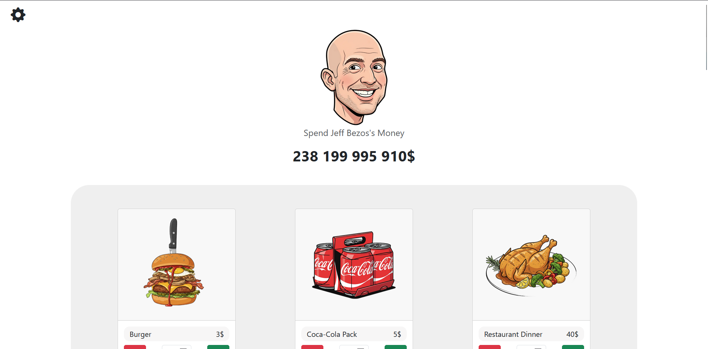

# 💸 Spend Billionaires' Money

A fun and interactive web game inspired by the original **“Spend Bill Gates’ Money”**, but with a twist — this version lets you spend the fortunes of **three billionaires**: **Jeff Bezos**, **Elon Musk**, and **Bill Gates**.

The game features a **cartoon-style visual design**, while maintaining the **same core mechanics** — you try to spend all the money by purchasing different items and watching your balance drop.

---

## 🖥️ Live Demo

🔗 **Play it here:** [Click here](https://agent-6914d7ca8325152e16b--spendbilionairesmoney.netlify.app/)

## 🚀 Features

- 🎮 Choose between **three billionaires** each with their own fortune.
- 💰 **Buy and sell** various items and see how your balance changes in real time.
- 🧩 Built entirely with **React** and modular **JSX components**.
- 🎨 Simple and colorful **cartoon-like UI**.
- ⚡ Fast and lightweight thanks to **Vite** and **React 19**.

---

## 🛠️ Tech Stack

**Frontend:**
- React 19
- React Router DOM 7
- Styled Components
- Bootstrap 5 + Bootstrap Icons

**Development Tools:**
- Vite (for fast development and builds)
- ESLint (code linting)

---

## 👓 Overview

---

